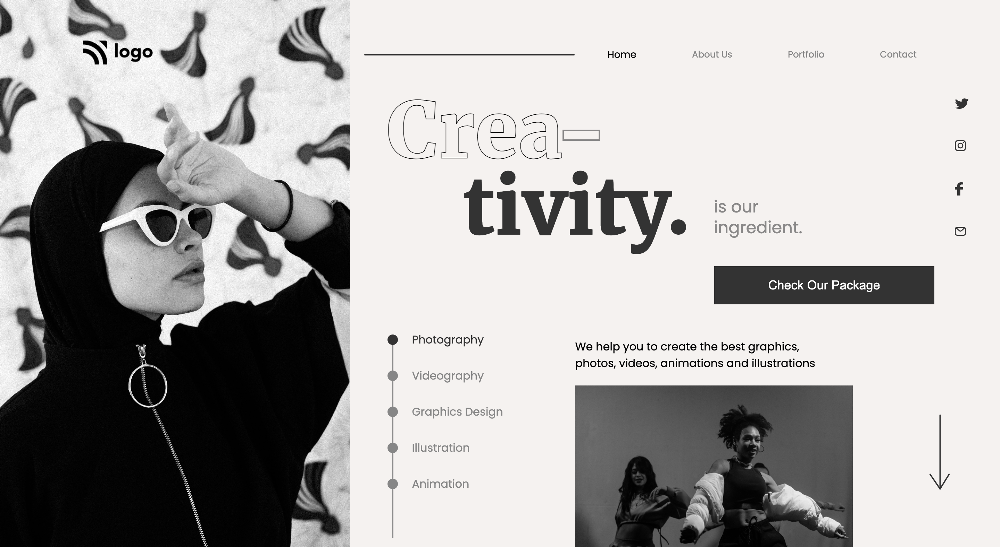

# Assignment 1

### Name:

> `Rishabh Thakur`

## Project 14 [Live Link](https://live-proj-14.netlify.app)

- Skills Gained in this project
  - Since this project is heavily based on positioning,
    Learned a lot about relative & absolute.
  - Learned to use **text-stroke-width** to create outline text effect.
  - Also Learned to create stepper using list item & div (By using relative & absolute)

---

#### Screenshot

## Time taken to finish this project

> `5 hour`
